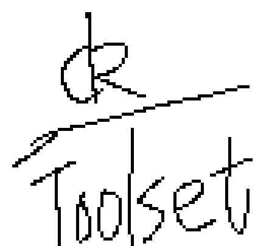

# digson-kirky
digson Tool set(Make a toolset based on it to be published on tl)

# How to mutate
Carried out 'sh build.sh'(We don't have Makefile here(This is required for all desktop environments except the toolset))

# The full name of the tool set
DeleKeseint is good toolset option(nanometer level)
